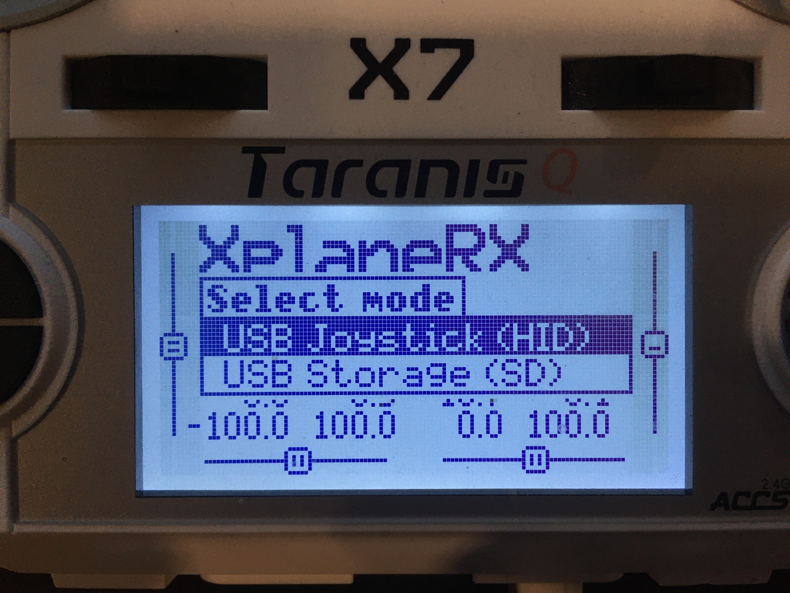
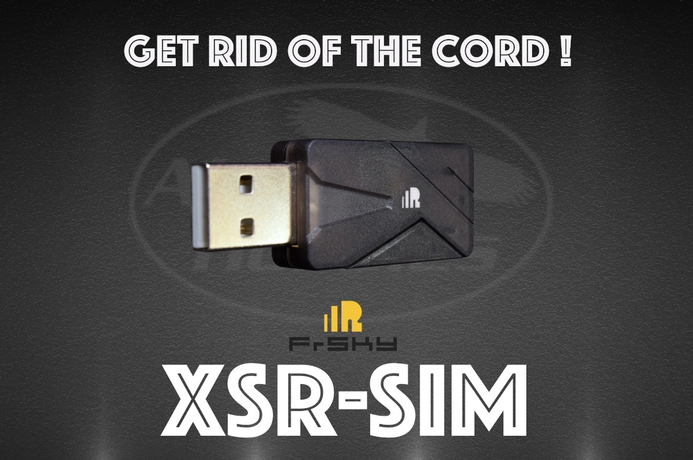

# FrSky Transmitter Setup

## USB Connection (Linux only!)
A FrSky transmitter can be connected directly to the computer running Via without the need for additional hardware by following these steps:
* Are you running Linux? If not, you will need to use the [FrSky Receiver](#frskyrx) instructions at the bottom of this page.
* Turn on the transmitter
* Connect to the computer via mini-USB cable
* Select "USB Joystick (HID)" mode on the transmitter (see picture)

 
 

## XSR-SIM
If you would prefer a wireless experience, you can use the [Frsky XSR-SIM dongle](https://www.frsky-rc.com/product/xsr-sim/). You connect your transmitter to this like you would any other receiver, and it interfaces with your computer like a joystick. You will have the same experience as though your transmitter was plugged in via USB.

## FrSky Receiver
-- DOCUMENTATION COMING SOON -- 
If you are here and need instructions, please reach out to us through www.copperpunk.com
