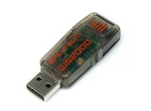

# Spektrum Transmitter Setup
Unfortunately there is no way to connect your Spektrum transmitter directly to your computer, so you will need to have some additional hardware if you are a Spektrum user. 

## USB Dongle
Currently the only documented option is to use the [Spektrum Wireless Simulator USB Dongle](https://www.spektrumrc.com/Products/Default.aspx?ProdID=SPMWS2000). This will make your transmitter act just like a joystick. Unfortunately this thing is $45, so maybe just consider an [FrSky transmitter](https://alofthobbies.com/radio/frsky-transmitters.html)?

