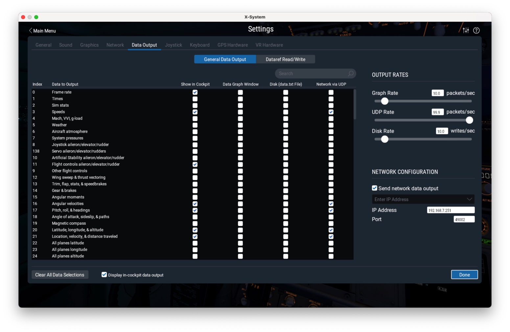

# X-Plane Simulation

Via uses off-the-shelf software for its simulation environments. Someday we will build a headless simulator in Gazebo, but for now we're taking advantage of what's already out there. If you would like to fly a Cessna in X-Plane with Via in the loop, you will need a Raspberry Pi 3 B/B+ (Linux is also supported, but that requires setting up a development environment). For now, please follow these steps:

0.  [Raspberry Pi setup](rpi.md).
1.  [Transmitter](transmitter.md) or [Keyboard](keyboard.md) setup.
2.  [Install X-Plane](https://www.x-plane.com/desktop/try-it/) (the demo version is fine)
3.  Modify X-Plane settings to output data via UDP. 

    In case you don't like looking at pictures, the following messages must have the **Network via UDP** box checked:
    *   3: Speeds
    *   16: Angular Velocities
    *   17: Pitch, roll, & headings
    *   20: Latitude, longitude, & altitude
    *   21: Location, velocity, & distance traveled

     The **UDP Rate** slider should be put up to its maximum value (99.9 packets/sec), not that our dev computers can ever seem to run it that fast.
     The **Send network data output** box should be checked, and you must specify the IP address of the Raspberry Pi that is running Via (it is shown on the Pi's display). The Port should be 49002.
4.  Start flying the Cessna Skyhawk in X-Plane (any airport will do). If you are not achieving at least 50 frames-per-second with your frame rate, you will need to turn down some of your graphics (maybe just turn them all the way down anyway).
